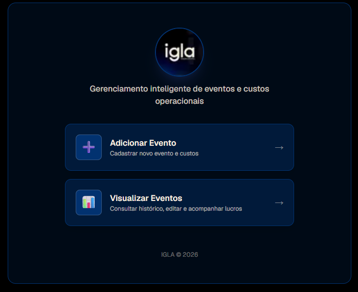
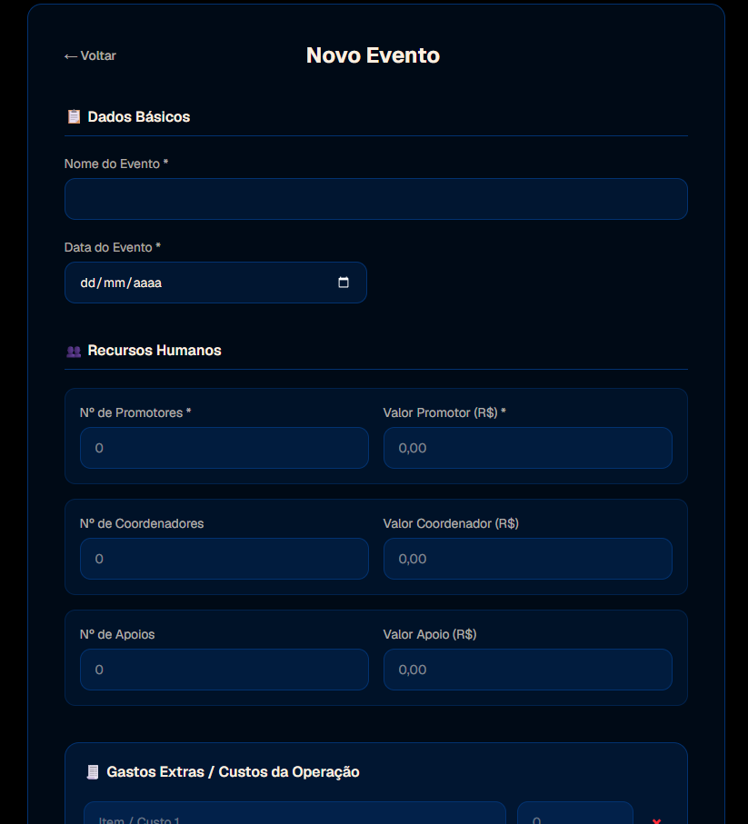

# 🎟️ Case Study: Sistema de Controle e Gestão de Eventos

> **Tipo de Projeto:** Solução Web sob medida para cliente / negócio local  
> **Status:** Concluído / Entregue (Acesso restrito ao cliente)  
> **Repositório:** [github.com/Nano2001nano/controle_eventos](https://github.com/Nano2001nano/controle_eventos)

---

### 📌 Contexto do Projeto
Esta aplicação foi desenvolvida e entregue sob medida para atender às necessidades operacionais de um cliente local no setor de eventos, centralizando a gestão de público, organização de escalas e validação de acessos.

---

### 🎯 O Desafio do Negócio
A gestão operacional de eventos frequentemente sofria com processos manuais, uso descentralizado de planilhas e mensagens de WhatsApp. O cliente enfrentava dificuldades como:
- Falta de controle em tempo real sobre presença, escala de equipe e histórico de eventos.
- Risco de inconsistência de dados e retrabalho na consolidação de relatórios pós-evento.
- Lentidão na validação de acessos na portaria/recepção através de dispositivos móveis.

---

### 💡 A Solução Desenvolvida
Foi desenvolvida uma aplicação web responsiva, centralizada e de alta performance, projetada para uso tanto administrativo quanto operacional:
- **Painel Administrativo:** Gestão completa de eventos, escalas, histórico e métricas de comparecimento.
- **Operação Mobile-First:** Interface fluida para leitura rápida de dados na entrada do evento.
- **Relatórios Automatizados:** Consolidação instantânea de presença e histórico operacional.

---

### 📸 Demonstração da Interface

| Painel Principal | Gestão de Eventos |
| :---: | :---: |
|  |  |

---

### ⚙️ Stack Tecnológica & Arquitetura
- **Core / Framework:** [Next.js](https://nextjs.org/) (React 19, TypeScript) com foco em velocidade e renderização otimizada.
- **Estilização:** [Tailwind CSS v4](https://tailwindcss.com/) para interfaces responsivas, modernas e carregamento rápido.
- **Backend as a Service & Auth:** [Firebase](https://firebase.google.com/) (Autenticação, Firestore para dados em tempo real e Storage).
- **Comunicação & Mensageria:** [Resend](https://resend.com/) para disparos automatizados de e-mails transacionais e confirmações.
- **Deploy & Infraestrutura:** Vercel com pipeline de CI/CD automatizado.

---

### 🏆 Desafios Técnicos Superados
1. **Modelagem de Dados e Tempo Real:** Estruturação no Firestore para suportar múltiplos eventos simultâneos e consultas rápidas sem lentidão.
2. **Controle de Acesso e Autenticação:** Implementação de regras de segurança no Firebase e rotas protegidas no Next.js para isolar permissões administrativas da equipe de apoio.
3. **Performance Operacional:** Interface responsiva desenhada para resposta instantânea em redes móveis (3G/4G) durante a realização dos eventos.

---

### 📈 Impacto & Resultados
- ⏱️ **Redução de tempo operacional** no credenciamento e validação de acessos.
- 📊 **Visibilidade de ponta a ponta** para a gestão do evento antes, durante e após a realização.
- 📉 **Eliminação do retrabalho** com consolidação manual de planilhas.